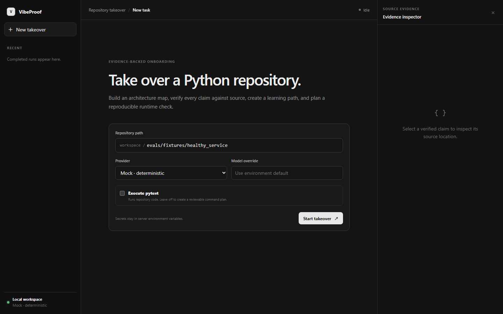

# VibeProof

VibeProof is an evidence-backed onboarding and takeover agent for Python repositories. It helps a developer move from
"the project runs" to "I can explain, verify, and safely change it."

第一次阅读代码时，可以先看中文的 [文件职责导览](docs/FILE_GUIDE.md)。

The current milestone accepts one local repository path and coordinates scanning, source indexing, architecture
analysis, citation review, a source-grounded learning path and quiz, and plan-first runtime verification into one report.
The same workflow is available through a Codex-inspired local Web workspace.



## Status

Implemented:

- uv-based Python 3.11 project and lockfile
- deterministic local repository scanner
- sensitive-file, binary-file, symlink, size, and file-count safeguards
- `RepositoryManifest`, `Evidence`, and `TakeoverReport` contracts
- read-only Git metadata parsing without executing repository hooks
- CLI, restricted FastAPI repository APIs, and a local Web takeover workspace
- unit tests and GitHub Actions CI
- an example manifest generated from the MindBridge repository
- AST-based classes, functions, async functions, decorators, docstrings, and import extraction
- snapshot-bound semantic source chunks with stable IDs and line evidence
- a local SQLite evidence store that is excluded from Git
- deterministic source retrieval with bounded excerpts and content hashes
- a real MindBridge index validation covering 49 Python files and 489 symbols
- a bounded `RepositoryAnalystAgent` with `SEARCH_SOURCE` and `FINAL_ANSWER` actions
- citation integrity review against the current SQLite snapshot
- auditable Agent traces and JSON/Markdown architecture reports
- offline mock, OpenAI-compatible, and Ollama model providers
- bounded retry for transient model transport failures and JSON response mode for OpenAI-compatible Agents
- plan-first runtime verification with fixed `pytest` and `pytest --collect-only` checks
- target-interpreter discovery, timeouts, bounded output, environment scrubbing, and before/after snapshots
- JSON and Markdown runtime reports that preserve both passing and failing evidence
- a `TakeoverCoordinator` that preserves partial results when analysis or runtime checks fail
- one-command JSON/Markdown takeover reports with a stage-by-stage execution trace
- bounded learning-evidence selection across architecture, entrypoint, test, framework, and dependency sources
- a `RepositoryTutorAgent` with reviewed learning units, exercises, and source-grounded quiz questions
- JSON answer templates bound to report, learning-plan, and source-snapshot identity
- an `AnswerReviewAgent` with per-question source excerpts, rubric-based scoring, and citation review
- Markdown/JSON learning progress reports with weak-unit recommendations
- task-specific offline analyst, tutor, and structure-only reviewer models for reproducible demos without a paid API
- deterministic Agent Eval metrics for workflow status, citation integrity, learning coverage, and runtime expectations
- healthy, intentionally broken, and async multi-component evaluation fixtures
- Codex-inspired task activity, result tabs, runtime terminal, and source-evidence inspector

Not implemented yet:

- LLM-generated architecture analysis
- persistent learning progress across multiple attempts
- arbitrary command execution or code modification
- GitHub App integration
- fine-tuned tool-risk model

## Quick start

```bash
uv sync --group dev
uv run python -m vibeproof takeover /path/to/python-repository --provider mock
```

Write the complete plan-only report as Markdown:

```bash
uv run python -m vibeproof takeover /path/to/python-repository \
  --provider mock --format markdown --output reports/takeover.md
```

Close the learning loop with a JSON takeover report, editable answers, and evidence-backed review:

```bash
uv run python -m vibeproof takeover /path/to/python-repository \
  --provider mock --format json --output reports/takeover.json
uv run python -m vibeproof quiz reports/takeover.json --output reports/answers.json
# Fill the answer fields, then use a semantic model for grading:
uv run python -m vibeproof review reports/takeover.json reports/answers.json \
  --provider ollama --model your-model --format markdown --output reports/review.md
```

`--provider mock` is also available for `review`, but deliberately performs structure-only validation and returns no
semantic score. The review reads source evidence from `--database` (default `.vibeproof/index.sqlite3`) and never runs
or modifies the target repository.

Evaluate the complete takeover against deterministic quality gates:

```bash
uv run python -m vibeproof eval /path/to/python-repository \
  --provider mock --format markdown --output reports/evaluation.md
```

Use `--case` for explicit expectations, including known runtime failures. See
[docs/EVALUATION.md](docs/EVALUATION.md) for the built-in fixtures and OpenAI-compatible relay configuration.

Explicitly execute the fixed test check as part of takeover:

```bash
uv run python -m vibeproof takeover /path/to/python-repository \
  --provider mock --check pytest --execute
```

Without `--execute`, the unified workflow scans, indexes, analyzes, reviews citations, generates a learning path and
quiz, and creates a runtime plan without running target code. A model or test failure produces a `PARTIAL` report
instead of discarding earlier evidence.

The individual commands remain available for inspection and debugging:

```bash
uv run python -m vibeproof scan /path/to/python-repository
```

Build the local source evidence index:

```bash
uv run python -m vibeproof index /path/to/python-repository
```

Search by qualified symbol, path, import, decorator, or source phrase:

```bash
uv run python -m vibeproof search /path/to/python-repository "ChatService.stream_chat"
uv run python -m vibeproof search /path/to/python-repository "router.post" --json
```

By default, source contents are stored in `.vibeproof/index.sqlite3`. Use `--database` to select another local path.

Run the offline, reproducible analyst loop:

```bash
uv run python -m vibeproof analyze /path/to/python-repository --provider mock
```

Write a Markdown report:

```bash
uv run python -m vibeproof analyze /path/to/python-repository \
  --provider mock --format markdown --output reports/architecture.md
```

Use a local Ollama model after setting its name:

```bash
export VIBEPROOF_AI_MODEL=your-local-model
uv run python -m vibeproof analyze /path/to/python-repository --provider ollama
```

For an OpenAI-compatible endpoint, configure `VIBEPROOF_AI_MODEL`, `VIBEPROOF_AI_BASE_URL`, and optionally
`VIBEPROOF_AI_API_KEY`; keys are never accepted as CLI arguments.

Review a runtime plan without executing repository code:

```bash
uv run python -m vibeproof verify /path/to/python-repository --check pytest
```

Execute the fixed check only after reviewing the plan:

```bash
uv run python -m vibeproof verify /path/to/python-repository --check pytest --execute
uv run python -m vibeproof verify /path/to/python-repository --check pytest-collect --execute \
  --format markdown --output reports/runtime.md
```

Interpreter selection is explicit `--python`, then the target repository's `.venv`, then VibeProof's current Python.
VibeProof does not create environments, install missing packages, accept arbitrary command strings, or revert files.

Write a manifest to a file:

```bash
uv run python -m vibeproof scan /path/to/python-repository --output target/repository-manifest.json
```

Run the API:

```bash
# Set this to a directory containing repositories that the API may inspect.
export VIBEPROOF_WORKSPACE_ROOT=/path/to/repositories
uv run python -m vibeproof serve
```

Open `http://127.0.0.1:8000` to use the Web workspace. Enter a path relative to
`VIBEPROOF_WORKSPACE_ROOT`, choose a configured provider, and start takeover. The browser never accepts or stores API
keys. Agent activity is shown in neutral gray; green, amber, and red are reserved for evidence outcomes.

On PowerShell:

```powershell
$env:VIBEPROOF_WORKSPACE_ROOT = 'D:\repositories'
uv run python -m vibeproof serve
```

The API deliberately accepts paths relative to `VIBEPROOF_WORKSPACE_ROOT`:

```http
POST /api/v1/repositories/scan
Content-Type: application/json

{"relativePath":"my-python-project"}
```

Run the complete plan-first workflow from the Web API:

```http
POST /api/v1/repositories/takeover
Content-Type: application/json

{
  "relativePath": "my-python-project",
  "provider": "mock",
  "executeRuntime": false,
  "runtimeCheck": "pytest"
}
```

`executeRuntime` must be explicitly enabled before the fixed pytest command is run. Clicking a verified claim in the
Web workspace requests only its bounded, repository-confined source range from `/api/v1/repositories/source`.

## Project structure

```text
vibeproof/
├── config.py          # environment variables and application defaults
├── agents/            # Analyst, Tutor, and Answer Reviewer agents
├── core/models/       # typed contracts grouped by business domain
├── repository/        # scanning, source indexing, retrieval, and SQLite evidence
├── llm/               # model protocol, providers, retry decorator, structured output
├── runtime/           # explicit repository test planning and execution
├── workflows/         # takeover, evaluation, and quiz use cases
├── reports/           # Markdown renderers
├── interfaces/        # CLI and FastAPI entry points
└── web/               # dependency-free browser interface
```

Dependencies point inward: `interfaces -> workflows/agents -> repository/llm/runtime -> core`. A dedicated architecture
test prevents lower layers from importing the API, reports, or workflow orchestration. See
[docs/FILE_GUIDE.md](docs/FILE_GUIDE.md) for the responsibility of each package.

## Development

```bash
uv run ruff check .
uv run python -m pytest
```

## Safety boundary

Scanning and indexing do not import target modules, install dependencies, run tests, execute Git commands, follow
symlinks, or read common secret files. Runtime verification is a separate, explicit `--execute` path. It uses tokenized
arguments with no shell, a timeout, bounded output, basic credential-looking environment removal, and repository
snapshots before and after execution. It is an evidence recorder, not a process sandbox. See
[docs/THREAT_MODEL.md](docs/THREAT_MODEL.md).

The analyst additionally limits its action, step, query, and evidence budgets. Repository snippets are untrusted prompt
data, and every final citation is independently reloaded from the current index. `SOURCE_SUPPORTED` means provenance was
validated; it does not claim that model-authored semantics were deterministically proven.

## Roadmap

1. ~~Source chunks with file and line evidence~~
2. ~~Evidence-backed architecture analysis~~
3. ~~Plan-first runtime verification and command evidence~~
4. ~~Repository takeover report and replayable workflow trace~~
5. ~~Source-grounded learning plans and quiz generation~~
6. ~~Evidence-backed answer review and learning progress~~
7. ~~Deterministic Agent Eval and repeatable failure fixtures~~

See [docs/MVP.md](docs/MVP.md), [docs/ARCHITECTURE.md](docs/ARCHITECTURE.md), [docs/DAY2.md](docs/DAY2.md),
[docs/DAY3.md](docs/DAY3.md), [docs/DAY4.md](docs/DAY4.md), [docs/DAY5.md](docs/DAY5.md), and
[docs/DAY6.md](docs/DAY6.md), [docs/DAY7.md](docs/DAY7.md), and [docs/DAY8.md](docs/DAY8.md).
